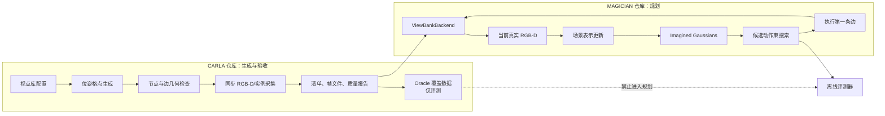
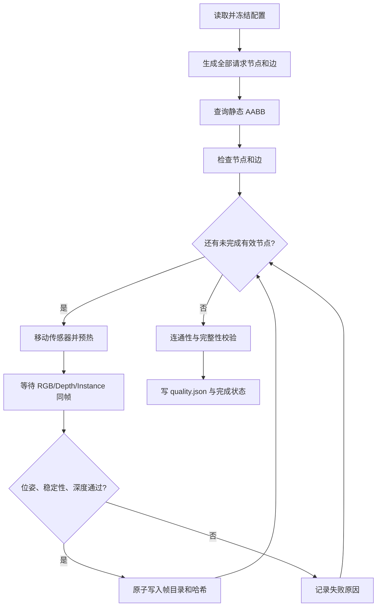
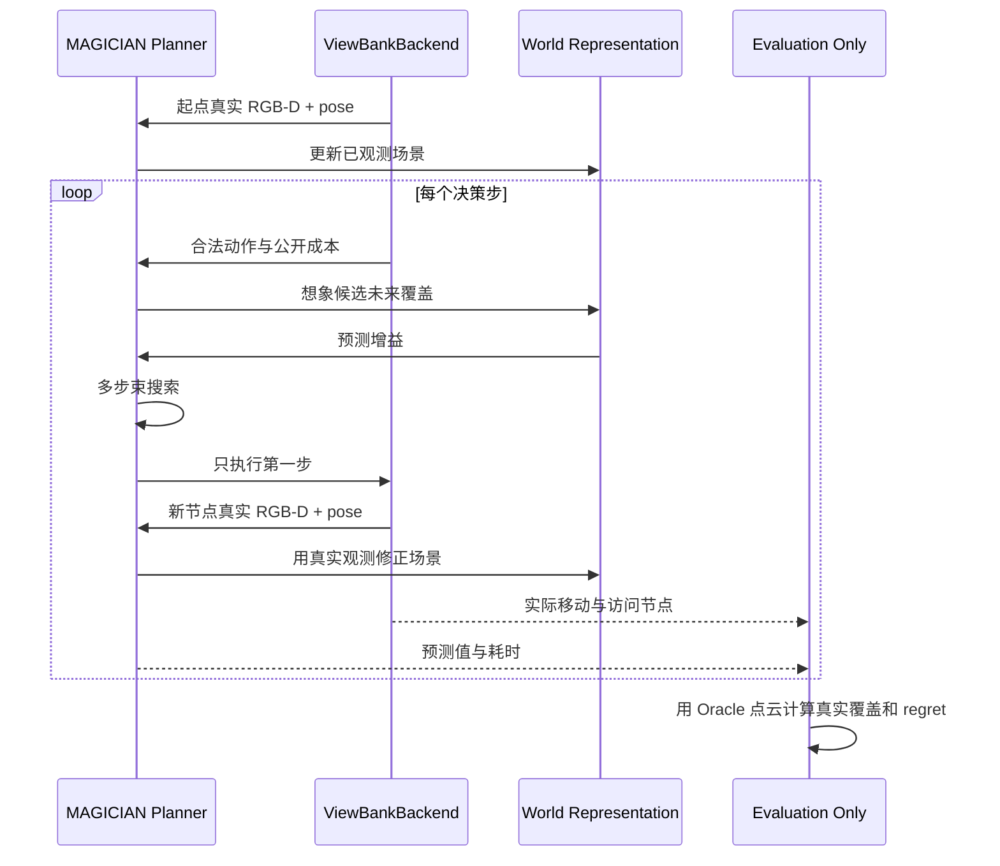

# CARLA—MAGICIAN 离线视点库概要设计

## 1. 总体结构



离线模式没有真实飞行动力学：`STEP` 只把当前节点切换到相邻节点。其研究价值在于保留 MAGICIAN 的信息闭环，
同时让每次真实观察可重复，并把 CARLA 通信、场景加载和算法调试分离。

## 2. 仓库目录规划

CARLA 生产端已按以下结构实现并接受本机离线测试；首次实拍未通过，修复版仍待服务器验收：

```text
cfg/viewbank/
  town10_aod_probe.yaml
src/viewbank.py                         # CLI：plan/capture/check（export 留待后续）
src/carla_experiments/viewbank/
  __init__.py
  config.py                             # 配置解析、schema 与阈值
  grid.py                               # 节点、动作和邻接边
  geometry.py                           # AABB、线段碰撞与连通性
  capture.py                            # 同步传感器和断点续采
  artifacts.py                          # JSONL、帧文件、哈希
  validate.py                           # 离线完整性和质量门
tests/test_viewbank_*.py
docs/magician-viewbank/
```

运行生成物继续写入被 Git 忽略的 `data/viewbank/` 或 `out/viewbank/`。配置、schema、代码和小型合成测试夹具进入 Git；
真实 RGB-D、权重、CARLA 发行包和大体积评测结果不进入 Git。

MAGICIAN 侧后续新增 `ViewBankBackend`、`PoseGraph` 和评测适配器。它消费稳定格式，不从 CARLA 仓库复制采集逻辑。

## 3. 配置模型

配置分为五组：

| 分组 | 关键字段 | 作用 |
| --- | --- | --- |
| scene | map、weather、seed、target、ROI | 固定世界快照 |
| camera | width、height、fov、pitch、exposure | 固定成像条件 |
| grid | origin、x/y/z offsets、yaw values | 生成节点 |
| graph | actions、clearance、edge sampling | 生成并验证边 |
| quality | pose/depth/frame/connectivity thresholds | 决定批次是否通过 |

首批 72 节点可采用 20 m 水平间距、两层安全高度、四个世界偏航作为起始值，但最终数值必须由
Town10HD_Opt 实拍和 AABB 检查决定。目标观察任务需要时，俯仰可以固定朝向 ROI 中心；偏航仍保留在节点状态中，
避免把“相同位置不同视线”混为一个节点。

## 4. 核心数据对象

### 4.1 `scene.json`

保存 `schema_version`、`scene_id`、CARLA/客户端版本、地图、天气、随机种子、配置哈希、Git 提交、局部坐标原点、
坐标约定、相机模型和传感器量纲。还应保存 `planner_visible_fields` 白名单，便于环境层拒绝诊断字段泄漏。

### 4.2 `nodes.jsonl`

每行一个节点，主要字段：

```json
{
  "node_id": "n_0000",
  "grid_index": [0, 0, 0, 0],
  "carla_transform": {"x": 0, "y": 0, "z": 0, "roll": 0, "pitch": -45, "yaw": 0},
  "local_pose": {"position_m": [0, 0, 0], "rotation_matrix": [[1, 0, 0], [0, 1, 0], [0, 0, 1]]},
  "valid": true,
  "invalid_reason": null,
  "frame_dir": "frames/n_0000"
}
```

真实覆盖、实例标签和目标可见性放在单独的评测记录中，不混入规划器默认加载的节点对象。

### 4.3 `edges.jsonl`

每行一个有向动作，包含 `source`、`target`、`action`、平移距离、转角、成本、合法性和拒绝原因。动作成本第一阶段
使用几何距离加可配置的转动代价；所有方法获得完全相同的边与成本。

### 4.4 `camera.json`

保存实际 frame/timestamp、请求和传感器实际位姿、内参矩阵、FOV、分辨率、深度语义、文件名和 SHA256。
该文件是 CARLA 采集事实；转换后的 PyTorch3D 相机参数另存，二者不能互相覆盖。

## 5. CARLA 采集流程



采集器复用 `scout` 已有的曝光稳定、同帧收件箱、深度解码和清理机制，复用 `aod` 的配置解析、静态 AABB 查询、
拒绝覆盖、JSONL/校验和风格。新模块负责规则图、边碰撞、断点续采和版本化 schema，不在旧命令上继续堆参数。

每个节点写入临时目录，文件全部落盘并校验后再原子改名。中断后根据清单与哈希恢复，既不覆盖已经通过的节点，
也不把部分文件当成成功节点。

## 6. MAGICIAN 环境适配

`ViewBankBackend` 对规划器暴露最小接口：

```text
reset(scene_id, start_node, budget, seed) -> observation
observe() -> rgb, z_depth, mask, camera
legal_actions() -> action list
step(action) -> observation, cost, done, info
```

内部维护 `current_node`、`visited_nodes`、累计成本和读取审计日志。`observe()` 只允许当前已执行节点；尝试加载其他节点
直接报错。`legal_actions()` 只返回当前节点出发的合法边。`step()` 不返回目标标签、Oracle 覆盖或未来节点摘要。

深度适配先读取 CARLA 射线距离，再转换成 MAGICIAN 使用的 z-depth。相机矩阵转换集中在一个模块，并用固定点、
相邻节点运动方向和点云重投影三类测试覆盖，禁止在各调用处临时翻轴。

## 7. 规划与评测时序



真实动作增益的计算发生在规划选择之后，并写入评测器。这样既能验证 Imagined Gaussians 的排序是否可靠，也不会用
真实未来信息替规划器做决定。

## 8. Oracle 覆盖定义

对所有有效视点的深度图按统一近远裁剪、掩码和体素尺寸反投影到局部世界坐标，合并后得到 Oracle 体素集合
`S_all`。轨迹访问节点形成 `S_t`，覆盖率为 `|S_t ∩ S_all| / |S_all|`。所有策略使用相同的体素参数和有效视点集合。

该指标衡量局部表面观测，不等于找到目标。第一阶段先验证 MAGICIAN 原生的主动建图行为；后续加入 detector 和漏检研究时，
必须另外定义目标发现率、确认率和错误排除率，不能把表面覆盖直接当作搜寻成功。

## 9. 实现阶段

### P0：离线图与 schema

实现配置、72 节点图、AABB 节点/边检查、清单写入和合成单元测试。输出不连接 CARLA 的计划报告和可视化摘要。

### P1：小规模采集

在已选 Town10HD_Opt 区域采 18 节点接口批次，验证同步、深度、位姿、坐标转换和断点恢复。通过后扩到 72 节点。

### P2：MAGICIAN 后端

在 MAGICIAN 仓库实现只读环境和读取审计，先用 Random/Greedy 跑通，再接 Imagined Gaussians 与 Beam Search。

### P3：覆盖评测

构造 Oracle 体素集合，报告覆盖、成本、预测排序、regret 和运行时间。若预测与真实增益无相关性，先修几何和相机接口，
不直接扩大数据规模。

### P4：在线化与目标任务

只有离线闭环通过后，才把 `ViewBankBackend.capture(node)` 替换成 CARLA 实时传感器调用，并逐步加入 detector、
疑似目标记忆、漏检风险和 DINO-WM。实时版本仍保留同一环境接口和评测协议。

## 10. 主要风险与控制

| 风险 | 结果 | 控制 |
| --- | --- | --- |
| 预采集导致未来信息泄漏 | 规划成绩虚高 | 当前节点白名单、读取审计、Oracle 分离 |
| 坐标/深度约定错误 | 重建图外观可看但几何错误 | 投影—反投影与运动方向测试 |
| 只检查端点 | 边穿过建筑 | 线段—膨胀 AABB 检查并记录原因 |
| 不同节点场景变化 | “新覆盖”来自动态变化 | 固定世界、天气、目标与曝光 |
| 视点过稀或全同质 | 所有策略无差异 | 先用 18 点诊断，再依据真实增益扩图 |
| 把工程 Pilot 当科研结论 | 无法支持方法主张 | 明确阶段门，至少加入公平基线和多场景后再论证 |

## 11. 需求追踪

| 需求 | 设计落点 | 首要验证 |
| --- | --- | --- |
| R-01 | `scene.json`、冻结配置、采集流程 | 相同配置的清单和环境哈希一致 |
| R-02 | `grid.py`、`nodes.jsonl` | 节点数、顺序和邻接关系确定性测试 |
| R-03 | `geometry.py`、`edges.jsonl` | 端点、穿越和边界相交合成测试 |
| R-04 | `capture.py`、`camera.json` | RGB/深度/实例 frame 与位姿对齐测试 |
| R-05 | `artifacts.py`、版本化 schema | 往返解析、相对路径和哈希校验 |
| R-06 | `ViewBankBackend`、读取审计 | 未访问节点和 Oracle 访问拒绝测试 |
| R-07 | Planner—Backend 时序 | 每轮只执行一边并重新观察的集成测试 |
| R-08 | 相机转换模块 | 投影—反投影和已知运动方向测试 |
| R-09 | Evaluation Only | 同起点、预算、边和成本的三基线对照 |
| R-10 | `validate.py`、`quality.json` | 损坏、缺失、中断和不连通批次拒绝测试 |


## 12. 本轮生产端实现决策

本轮只交付 P0 和 P1 的采集软件及模拟验证；P1 首次实拍失败，修复版待重新采集，P2–P4 未实现。
[实现格式说明](README.md) 为实际字段与命令的权威说明；前文示例及后端时序继续描述目标设计。

- `requested_transform`/`actual_transform` 使用已有 scout 的 `[x,y,z,pitch,yaw,roll]` 数组约定，
  替代前文示例中的对象字段；字段顺序写入 scene 坐标说明。`local_pose` 包含位置、角度和旋转矩阵。
- `camera.json` 内参对应所有传感器共同的固定针孔配置，逐图核对实际 FOV/尺寸，保存每通道原始拍摄位姿；K 由实际 FOV/尺寸计算。
- 增加 `config.resolved.json`、`summary.json`、`region_geometry.json` 和逐节点 `receipt.json`，
  后者解决目录已原子提交、节点清单尚未更新时的恢复窗口；不改变需求中的帧文件路径。
- `check` 独立重建理论图、节点几何和边合法性；不只信任清单中的 valid 标记。
- 精确 slab 相交优于步进采样；`edge_step_m` 作为显式配置保留，并在输出说明当前不用于采样。
- 18 节点配置为 3×3×2×1，同一套相机与原点；72 节点完整 Pilot 才包含四向 yaw 动作。
- 第一批采集是原有地图静态环境，不复用旧 AOD 分批生成的目标车辆，不生成新的目标类别/标签。
  外部动态 Actor 拒绝；交通灯冻结红灯并恢复。未来受控目标配置需单独扩展 schema 和测试。
- 公共同步相机设置从 AOD 抽取到 runtime，蓝图属性检查/弱引用回调从 scout 抽取到 sensors。
  三路配对、稳定性和深度解码直接复用 scout_quality；Actor 清理直接复用 OwnedActors。
- 所有单位和左右手/光学轴约定明确记录；射线距离与 z-depth 分开，当前只落盘前者。
- 输出锁使用 OS advisory lock；配置或环境指纹不匹配拒绝续采；图像文件的独立 receipt 是恢复依据。
- 格式分离 diagnostic/evaluation 与 observation，但本轮没有实现后端访问控制，不能声称防泄漏闭环已验收。

[服务器操作文档](server-operations.md) 列出 18 节点实拍、质量检查、重试、72 节点扩展和整库复制步骤。
AABB 不是飞行安全证明；单区域接口批次也不能支持 MAGICIAN 更优秀的研究结论。


2026-09-25 的首次数据诊断及后续修复见 [first-capture-diagnosis.md](first-capture-diagnosis.md)。
固定天气增加实际回读门，黑白退化帧增加可配置均值质量门；预设参数映射作为环境版本 2 记录，
因此不与旧环境混合续采。schema 仍为 v1，新增质量参数对旧配置读取兼容。


### CARLA 0.10.0 固定日间适配（2026-09-26 更正）

官方 0.10.0 发布说明将可修改天气列为未迁移能力，天气固定为日间。
此前“缺少天气 Actor 就必须修复地图”的推断不适用于所有 0.10.0 发布版。
默认配置采用显式 MapDefaultDaylight：只接受 0.10.0/Town10HD_Opt/天气 API 不可用这一已知组合；
保留原有 API 预设的严格天气能力和回读校验，不进行自动 fallback。
固定日间不调用天气 setter，实际数值标记不可观测/null；原始占位读数仅归入 diagnostic。
`doctor` 与 capture 共用预检；check 核对模式、版本、地图及无伪造数值的元数据。
新 scene_id 为 v3、配置哈希变化，使用新目录；RGB、深度、几何、同帧和位姿质量门继续生效。
同一地图构建的固定照明是发布版运行假设，仍需人工图像验收，不能声称已测量太阳高度或风速。
详见 [服务器操作](server-operations.md)。


### 曝光对照工具

增加 calibrate.py 作为 capture 的薄编排层：生成固定双点配置和四组手动曝光候选，依次调用 capture，
读取验收/拒绝图像生成诊断报告。源码仍只有一套传感器、同步、几何、原子写入与清理实现。
对照不是正式视点库，候选不自动成为生产参数；完整网格 YAML 供人工选择后重新采集。
新增模块是原计划结构的小幅扩展，避免把曝光实验逻辑混入固定策略观测接口。
